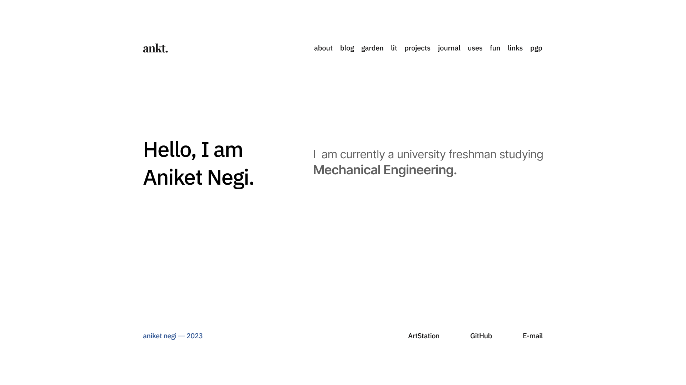

## Introduction

This website has been exactly 4 weeks in the making as of today, and it is still far from complete. I am writing this post as both a test and a milestone. Inspired mostly by my previous failed attempt at maintaining an online personal space ([here](https://aniketnegi.github.io)), I aim to be better this time around. 

## On having a Personal Space on the Internet

Social Media is all the rage these days. Being a teenager and having spent ungodly amounts of time there, the culture of the social medias has been unconciously, deeply ingrained into my brain. I do not like that.
While the concept of social media in itself is not malicious, the way it is used by everyone is.
Sites like FaceBook, MySpace, Reddit came up in quick succesion, and people flocked to them in hopes of becoming a part of larger communities with common interests and learning new things in the process.
But, the current state of social media sites is no news to anyone. It is a place where companies farm user attention for profit, and creators farm follower attention for clout. It has changed the way I, personally, think about everyday interactions in a negative way.
The herd mentality online is obvious to anyone with above room temperature IQ. I believe a person needs a space where they can share their thoughts unfiltered, which helps one know another for who he truly is, and not as a mask that one has put on to generate content.   
A personal website is like a node in a community, where one can share their views with the group without the influence of algorithms and money.

## Plans for this website

I plan to continue building and evolving this website. It has already come a long way from the first design I made on Apr 20.  Most of the pages are WIP currently. I also plan to make a Digital garden from scratch using Astro's Content Collections (which is currently powering this blog). Although I will admit my previous attempts at making a digital garden have failed miserably. I think this is because I am afraid of putting content out on the internet, and it not being perfect. But that is the whole point of a digital garden.
Even this blog is being written as it comes to me. It might seem structureless. That sentence made you feel like there's something more coming huh. LOL.

## The State of Web Development in 2024

It seems everyone has an opinion on what web development is like. I don't care much for the discourse. Use what is necessary to get the task done, and only what is necessary. And don't care for the rest. I chose to use [AstroJS](https://astro.build/) for this my website because I knew I would need a Static Site Generator with scope to expand in the future. Traditional SSG's like Hugo, Zola, Eleventy didn't make the cut because I did not see the scope for expansion. And Astro is just plain HTML/CSS/JS, so that a huge positive.

## Closing Thoughts

I hope to recover from the Instagram Reels brainrot infestation. Soon I plan to self-host this website and eventually move my social life away from "social media". I also plan to get good grades next sem, but 💀.

Here's a code block because it is really cool that `mdx` can do that

```c
#include <stdio.h>

int main() {
    char *name = "ankt";
    printf("Hello to %s's site!", name);

    return 0;
}
```
