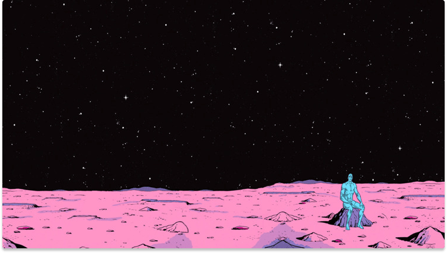

## Introduction

Lorem ipsum dolor sit amet consectetur adipiscing elit Ut et massa mi. Aliquam in hendrerit urna. Pellentesque sit amet sapien fringilla, mattis ligula consectetur, ultrices mauris. Maecenas vitae mattis tellus. Nullam quis imperdiet augue. Vestibulum auctor ornare leo, non suscipit magna interdum eu. Curabitur pellentesque nibh nibh, at maximus ante fermentum sit amet. Pellentesque commodo lacus at sodales sodales. Quisque sagittis orci ut diam condimentum, vel euismod erat placerat. In iaculis arcu eros, eget tempus orci facilisis id. Praesent lorem.

## One More Heading 2

Lorem ipsum dolor sit amet consectetur adipiscing elit Ut et massa mi. Aliquam in hendrerit urna. Pellentesque sit amet sapien fringilla, mattis ligula consectetur, ultrices mauris. Maecenas vitae mattis tellus. Nullam quis imperdiet augue. Vestibulum auctor ornare leo, non suscipit magna interdum eu. Curabitur pellentesque nibh nibh, at maximus ante fermentum sit amet. Pellentesque commodo lacus at sodales sodales. Quisque sagittis orci ut diam condimentum, vel euismod erat placerat. In iaculis arcu eros, eget tempus orci facilisis id. Praesent lorem.

## Something More Detailed

### First Option

Lorem ipsum dolor sit amet consectetur adipiscing elit Ut et massa mi. Aliquam in hendrerit urna. Pellentesque sit amet sapien fringilla, mattis ligula consectetur, ultrices mauris. Maecenas vitae mattis tellus. Nullam quis imperdiet augue. Vestibulum auctor ornare leo, non suscipit magna interdum eu. Curabitur pellentesque nibh nibh, at maximus ante fermentum sit amet. Pellentesque commodo lacus at sodales sodales. Quisque sagittis orci ut diam condimentum, vel euismod erat placerat. In iaculis arcu eros, eget tempus orci facilisis id. Praesent lorem.



### Second Option

Lorem ipsum dolor sit amet consectetur adipiscing elit Ut et massa mi. Aliquam in hendrerit urna. Pellentesque sit amet sapien fringilla, mattis ligula consectetur, ultrices mauris. Maecenas vitae mattis tellus. Nullam quis imperdiet augue. Vestibulum auctor ornare leo, non suscipit magna interdum eu. Curabitur pellentesque nibh nibh, at maximus ante fermentum sit amet. Pellentesque commodo lacus at sodales sodales. Quisque sagittis orci ut diam condimentum, vel euismod erat placerat. In iaculis arcu eros, eget tempus orci facilisis id. Praesent lorem.

## Code Examples

Here is some python code. [second post](../second-post/)

```python
def list_sq(l):
    for i in l:
        yield (i**2)


l = [1, 2, 3, 4, 5]
new = list_sq(l)
print(next(new))
print(next(new))
print(next(new))
print(next(new))
print(next(new))
```

## Todo

- first one
    1. Tables
    2. Callouts
    3. Indent Block
    4. LaTeX
